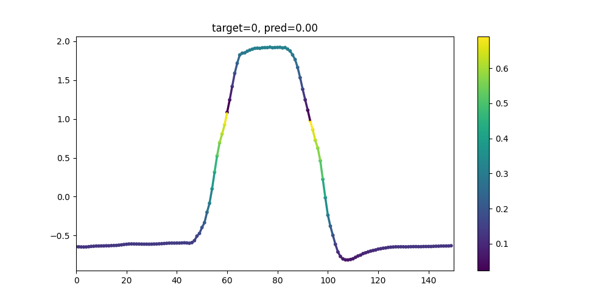

# GradCAM on Time Series
Programming Assignment 2 for Explainable Artificial Intelligence 2023/2024 classes at Jagiellonian University

The goal is to demonstrate GradCAM visualisation on 2 datasets:
- https://www.timeseriesclassification.com/description.php?Dataset=GunPoint 
- https://www.timeseriesclassification.com/description.php?Dataset=Yoga 

# Results
## GunPoint

## Yoga

